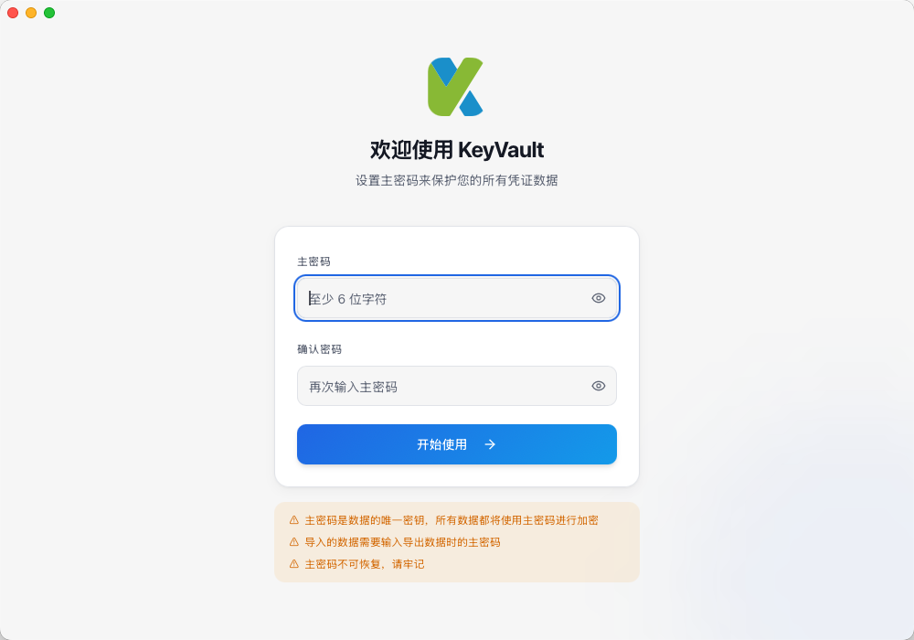
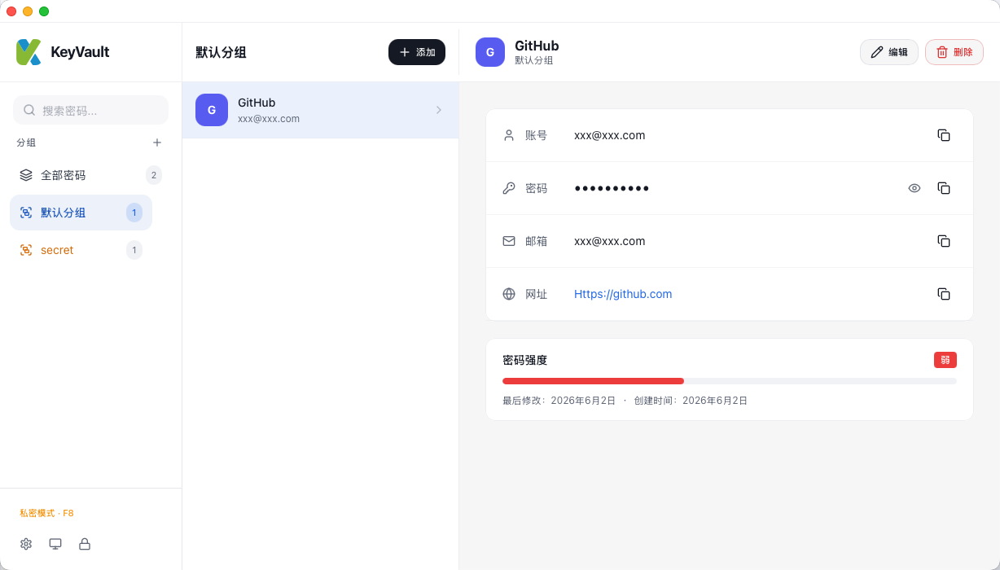

# KeyVault — 离线密码管理器

KeyVault 是一款基于 Tauri v2 构建的跨平台桌面密码管理应用。所有数据本地加密存储，无需联网，保障隐私安全，支持windows和macOs。

[下载地址](https://github.com/furising/KeyVault/releases)

## 功能特性

- **主密码保护** — 首次启动设置主密码，后续每次打开应用需验证身份
- **AES-256-GCM 加密** — 密码字段始终以密文存储，每条记录使用独立随机 IV
- **分组管理** — 创建分组对密码进行分类，支持私密分组（额外密码保护）
- **密码增删改查** — 支持应用名、账号、密码、URL、邮箱、描述等完整字段
- **模糊搜索** — 按应用名实时搜索，300ms 防抖
- **一键复制** — 每个字段均可一键复制到剪贴板
- **导入/导出** — JSON 格式备份，导出密码保持加密状态
- **亮色/暗色主题** — 支持手动切换或跟随系统
- **全局快捷键** — F8 一键切换私密分组显示（可自定义）
- **修改主密码** — 支持在应用内安全修改主密码，自动重新加密所有数据

## 页面流转

```
首次启动 → 设置主密码页 → 密码库
后续启动 → 解锁页 → 密码库
```



```
密码库默认不显示私密分组，需要按F8进行切换（也可以自定义快捷键）
```



密码库主页包含：左侧分组侧边栏 + 右侧密码列表 + 顶部搜索栏和操作按钮（添加密码、导入、导出、锁定）。

> 注意：导入数据的时候，需要输入导出数据应用的主密码。
